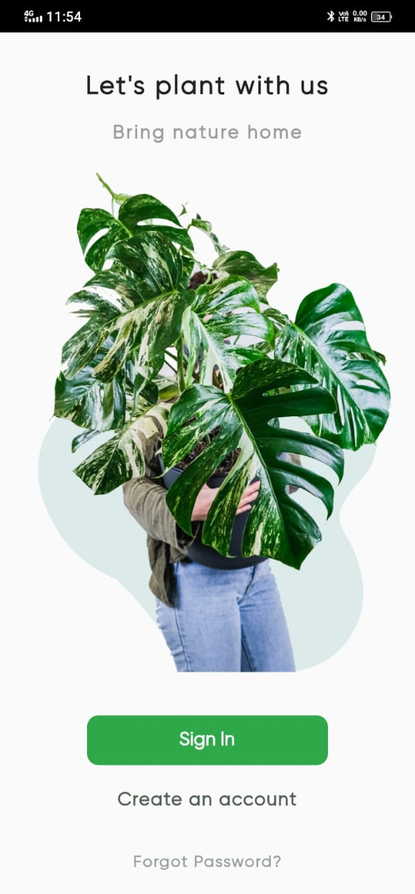
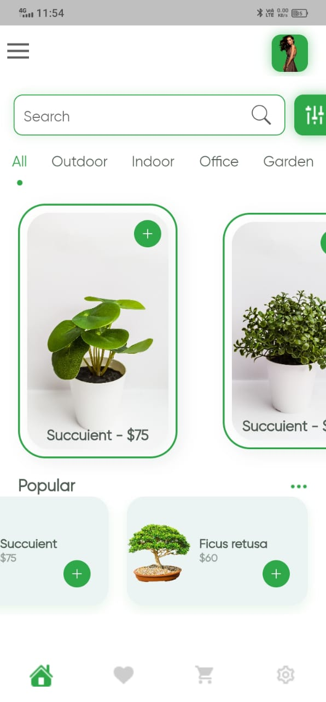
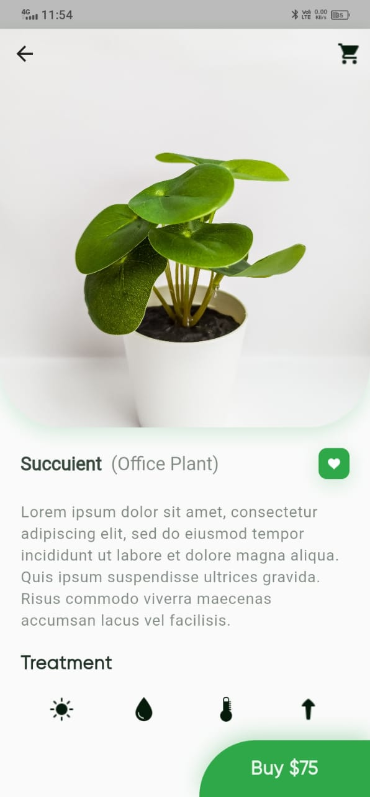

# 🌿 Plant App

Welcome to the Plant App, a Flutter-based mobile application designed for plant enthusiasts. This app features a beautiful and attractive UI design and a range of features to help plant lovers care for their green companions.

## Features 🌟

- **Beautiful UI Design**: Our app boasts a visually appealing and user-friendly design, making it a joy to use for all plant enthusiasts.

- **Plant Catalog**: Explore a diverse catalog of plants, each with detailed information, and high-quality images.

- **Community**: Join our community of plant lovers, share your plant collection, seek advice, and connect with like-minded individuals.

## Screenshots 📸
| **Browse through our diverse catalog** | **Engage with the plant-loving community** | **Discover plant care tips and tricks** |
|---|---|---|
|  |  |  |


## Installation 🛠️

To get started with the Plant App, follow these steps:

1. Clone the repository to your local machine:

   ```bash
   git clone https://github.com/umarazizdev/Plant-App.git
2. **Navigate to the project directory:**
   ```bash
   cd Konstructora

3. **Install dependencies:**
   ```bash
   flutter pub get

4. **Run the app:**
   ```bash
   flutter run
 
 ##  Contributing 🤝
 Contributions are welcome! Please follow our contribution guidelines.
 ## Contact 📩
 For inquiries, please contact umar.aziz.dev@gmail.com.
 Happy planting! 🌿🌱
